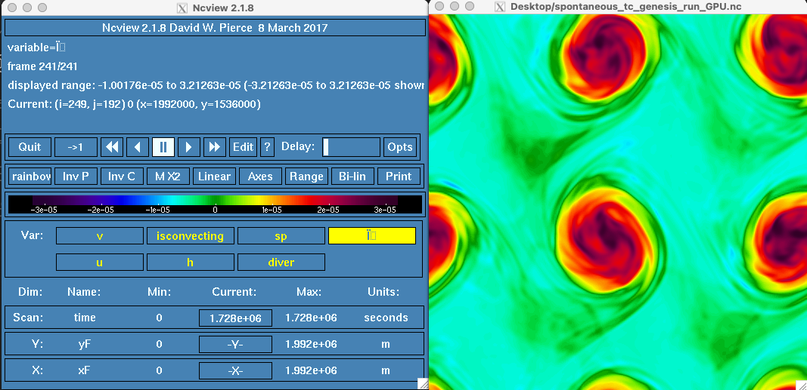
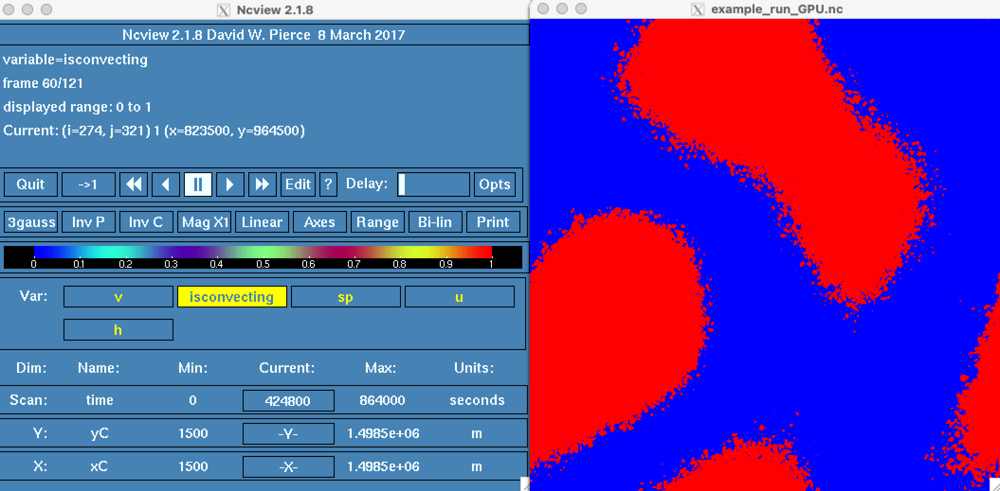

## Parameterized convection on a shallow water model

This project implements the convective parameterization of:

Yang, D., and A. P. Ingersoll, 2013: Triggered Convection, Gravity Waves, and the MJO: A Shallow-Water Model. J. Atmos. Sci., 70, 2476–2486, https://doi.org/10.1175/JAS-D-12-0255.1.

On the Shallow Water model of Oceananigans.jl. It is currently supposed to work on GPU and CPU architecture.

It relies in:
- [Oceananigans.jl](https://github.com/CliMA/Oceananigans.jl) for the model (see website for docs)
- [Julia Language v1.7.1](https://docs.julialang.org/en/v1.7.1/) for the language (check website for docs), especially [this](https://docs.julialang.org/en/v1.7.1/manual/getting-started/).

It currently includes:
- Coriolis (f-plane)
- gravity
- convection

This is experimental work carried out at the University of California Davis by Argel Ramírez Reyes

So far it has shown that convection aggregates in this Shallow Water Model with rotation (spontaneous TC genesis):



And without rotation



# To reproduce this simulation (around 5 minutes in GPU and ~1hour with 32 cpu cores):

## How to setup your environment
1. First, download the julia language v1.8. The current recomended way to use julia is via [juliaup](https://github.com/JuliaLang/juliaup)
1. Clone this repository using git. From your bash session you can do:


    ```bash
    git clone https://github.com/aramirezreyes/RamirezReyes_ShallowWaterInFPlane --branch arr_dissertation --single-branch
    ```

    This should create a folder called `RamirezReyes_ShallowWaterInFPlane`

1. cd into this folder
1. launch julia from where you installed it:

    ```bash
    julia --project=@.
    ```

1. Once you are in julia, press `]` to enter package mode and type `instantiate`
    `]instantiate`
    this will install the required julia packages. This step is only necessary the first time that you run it.
1. Exit julia using `CTRL+D` or by exiting the package mode (backspace) and writing `exit()`

## How to run an example
Assuming you are on the folder RamirezReyes_ShallowWaterInFPlane, use bash to launch julia in the following way:

`/path/to/julia/bin/julia --project=@. -t 8 scripts/examples/convective_aggregation_cpu.jl`

These run the cases found in scripts/examples/convective_aggregation_cpu.jl using 8 cores. Ideally you will run it in a bigger computer and you will be able to use more cores.

If you have a CUDA-capable GPU you can run a gpu example:

`/path/to/julia/bin/julia --project=@. -t 8 scripts/examples/convective_aggregation_gpu.jl`

Which will run it on the GPU

You can modify the parameters found in there in any text editor.

The output will be written in the folder called "data" in NetCDF format

#### Parallel scaling
For a test run with domain of 500x500 saving the 8 variables every 100 timesteps with timestep of 5 seconds I observed the following performance for a 3 hour simulation. It is unimpressive but it gives an Idea about the scaling.:


Apparently the optimum is with 32 cores (tested on NERSC Perlmutter)